# Домашнее задание 3

Устанавливаем Docker Desktop, kubectl и minikube. Добавляем kubectl.exe в окружение PATH. Проверяем, что все установлено корректно:

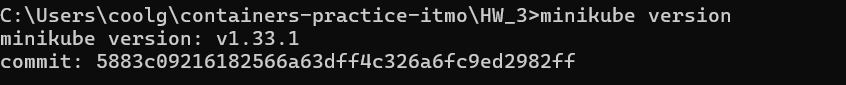
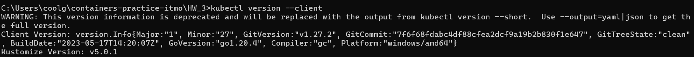
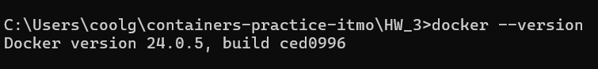

Запускаем Minikube c помощью команды **minikube start**. 
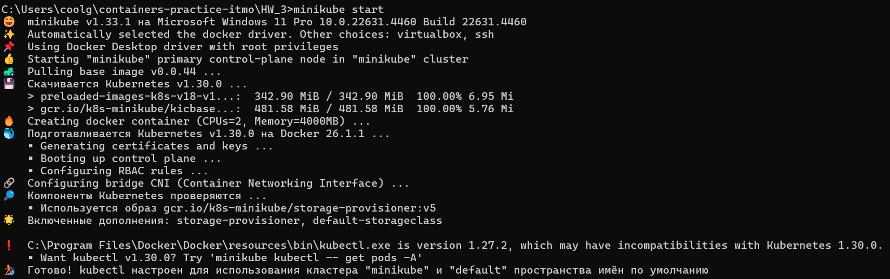

Minikube позволяет создать локальный кластер Kubernetes в виде Docker-контейнера. С помощью команды **docker ps** видим соответствующий контейнер:

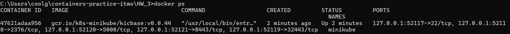

Конфигурация созданного кластера выглядит следующим образом:

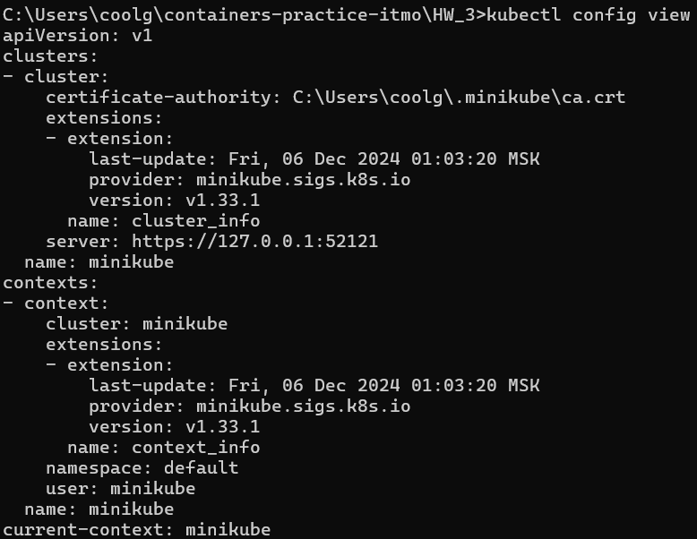

Создан кластер minikube. По умолчанию в созданном кластере находится 1 узел.

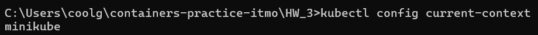

Создадим в текущей директории манифесты Postgres согласно заданию. После этого выполним команды **kubectl create -f filename**, чтобы описанные объекты создались в кластере. 

**Ответ на вопрос**: порядок исполнения не важен, так как Kubernetes обрабатывает каждый ресурс независимо

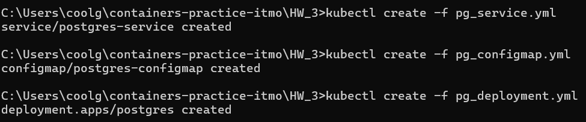

Проверим успешность создания ресурсов с помощью команд **kubectl get ...**

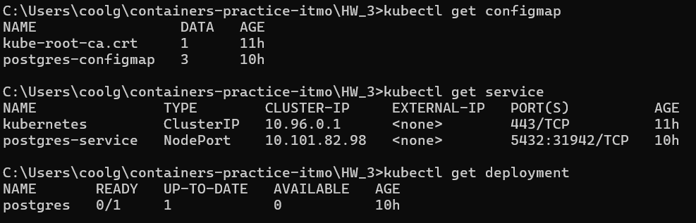

Ресурсы созданы успешно. Также видим postgres в списке созданных подов:

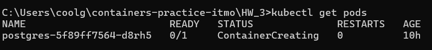

Теперь создадим **nextcloud.yml** и создадим соответствующий объект в кластере. Создался еще один под:

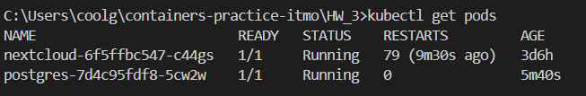
Создался секрет с паролем администратора, который невозможно посмотреть

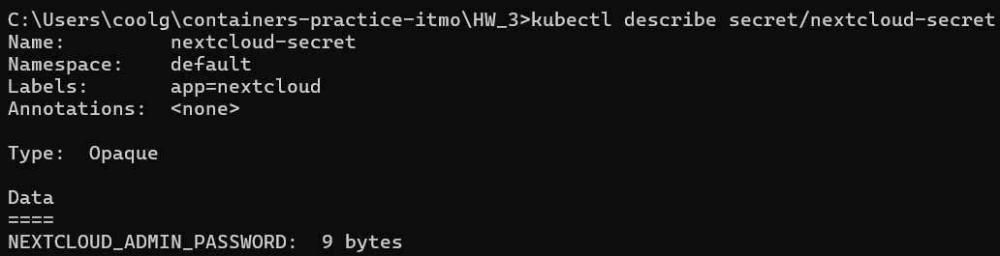

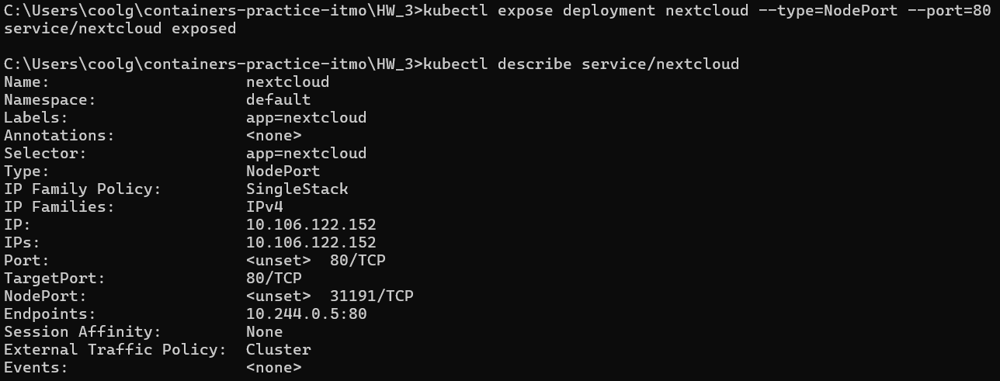

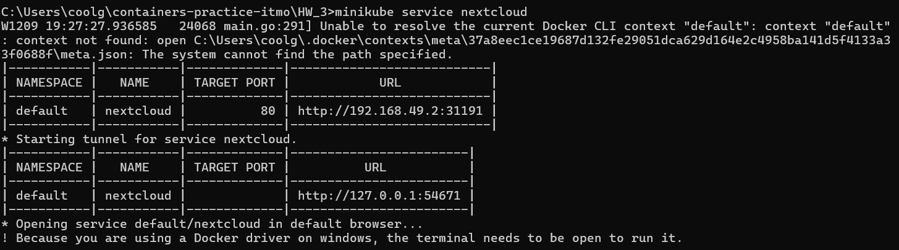

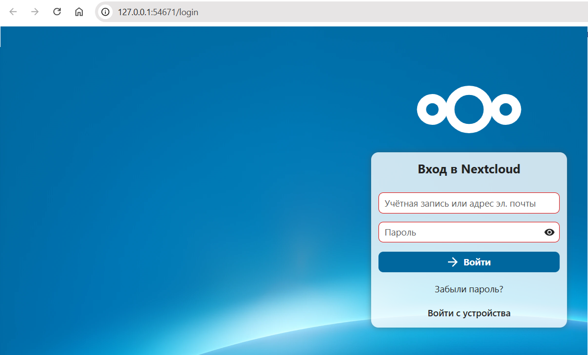

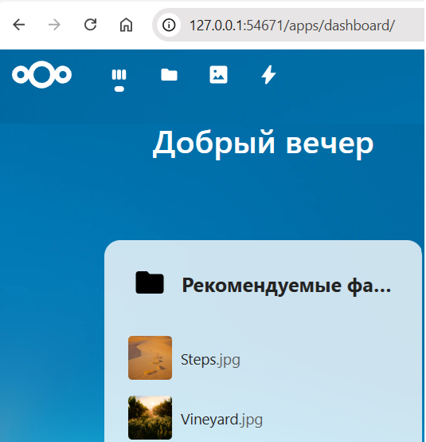

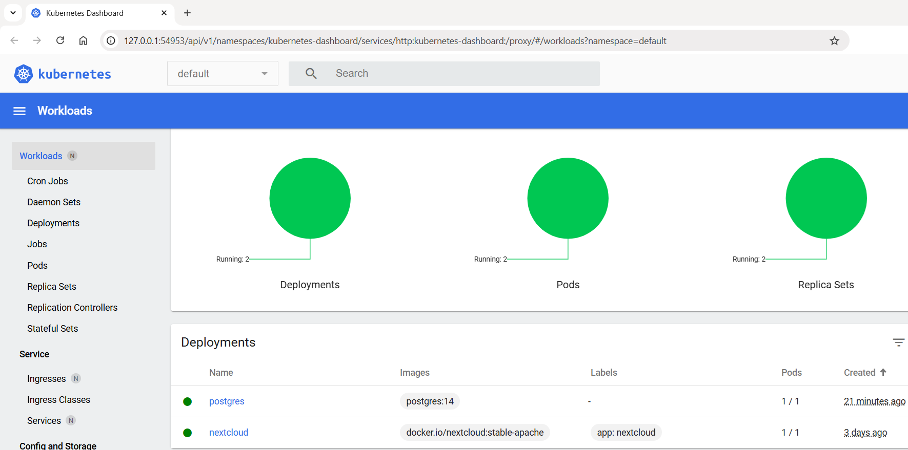

Ответ на вопрос: 

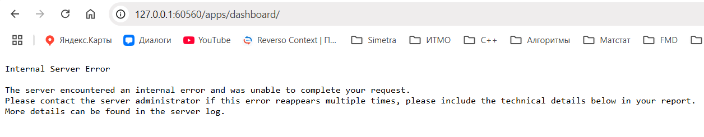

