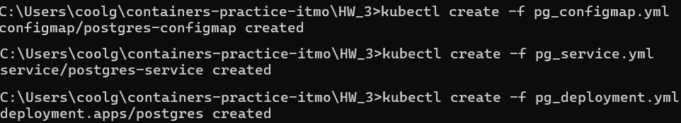

# Домашнее задание 3

Устанавливаем Docker Desktop, kubectl и minikube. Добавляем kubectl.exe в окружение PATH. Проверяем, что все установлено корректно:

Запускаем Minikube c помощью команды **minikube start**. 

Minikube позволяет создать локальный кластер Kubernetes в виде Docker-контейнера. С помощью команды **docker ps** видим соответствующий контейнер:

Конфигурация созданного кластера выглядит следующим образом:

Создан кластер minikube. По умолчанию в созданном кластере находится 1 узел.

Создадим в текущей директории манифесты Postgres согласно заданию. После этого выполним команды **kubectl create -f filename**, чтобы описанные объекты создались в кластере. 

**Ответ на вопрос 1**: порядок исполнения важен. Сначала создается файл configmap, в котором содержатся настройки среды. 
В дальнейшем эти настройки передаются в deployment (файл с описанием пода). Если не создать configmap до deployment, настройки не применятся и под не запустится.
Далее создаем service - это сетевая конфигурация, а затем уже deployment.
Порядок создания ресурсов представлен на рисунке ниже.

Проверим успешность создания ресурсов с помощью команд **kubectl get ...**

Ресурсы созданы успешно.
Теперь создадим **nextcloud.yml** и создадим соответствующий объект в кластере. Создался еще один под:

Создался секрет с паролем администратора, который невозможно посмотреть

Кроме способа создания через манифест, объект типа Service можно создать с помощью команды ниже, которая обеспечит нужное перенаправление портов.

Запустим сервис nextcloud:

Видим следующий интерфейс:

Зайдем с помощью логина и пароля администратора Nextcloud:

У minikube есть удобный dashboard, который открывается в браузере:

С помощью дашборда попробуем сделать количество реплик postgres-deployment = 0, а затем снова = 1, и посмотрим, что произойдет.

**Ответ на вопрос 2:** так как под с postgres эфемерен, он постоянно не хранит в себе данные. При удалении реплики данные теряются (если не примонтировать volume), а nextcloud не пытается восстановить соединение. Когда заново создается реплика, nextcloud не пытается заново подключаться к базе. Если зайти в этот момент в nextcloud, будет показано вот такое сообщение:

Проведем все преобразования с yml-манифестами согласно заданию. Убедимся, что все работает корректно. Посмотрим на код ответа, возвращаемый при запросах в рамках пробы. Видим, что код 200 - значит, сервис nextcloud работает корректно.

