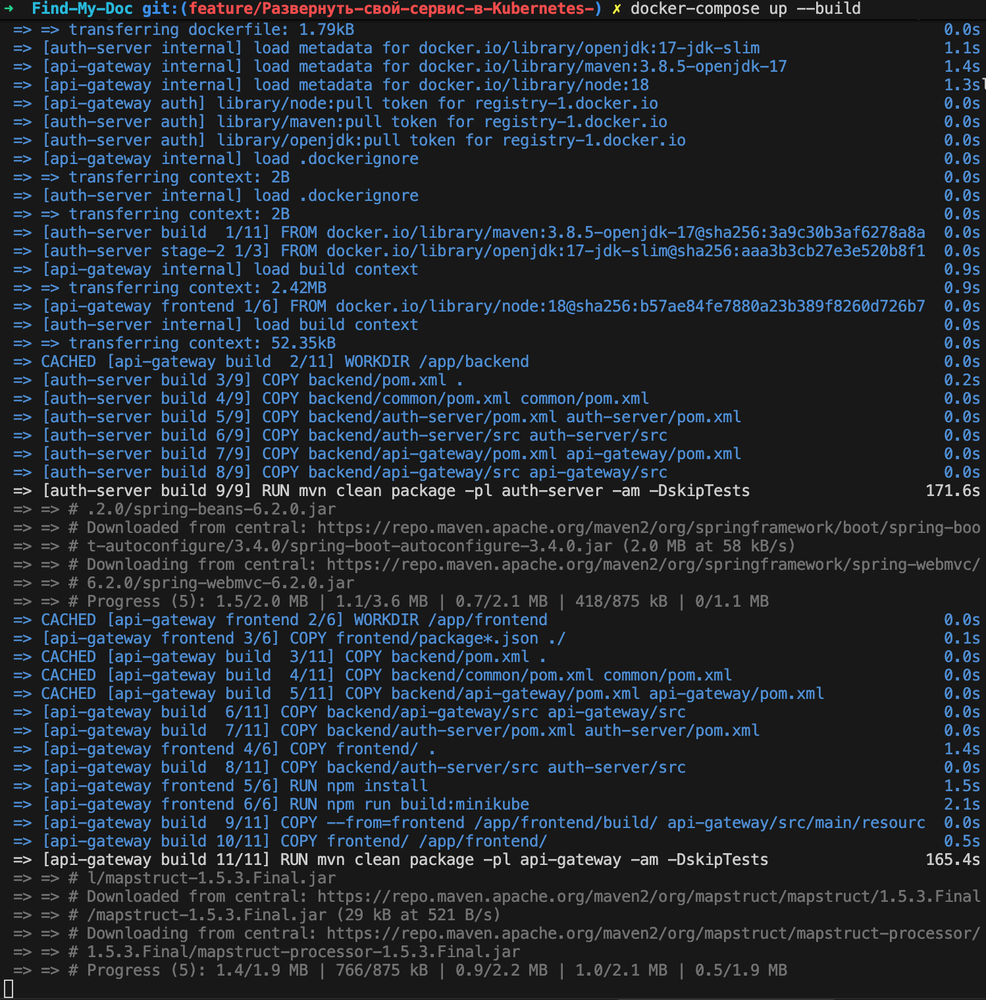
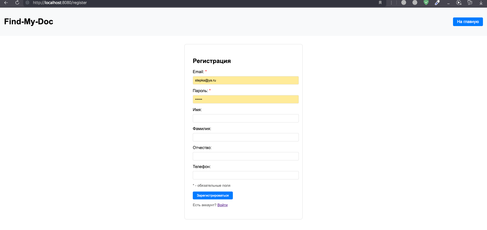
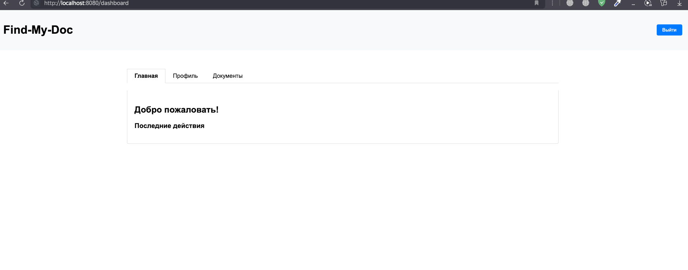
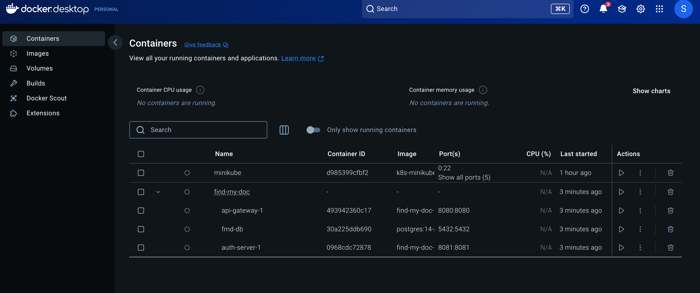
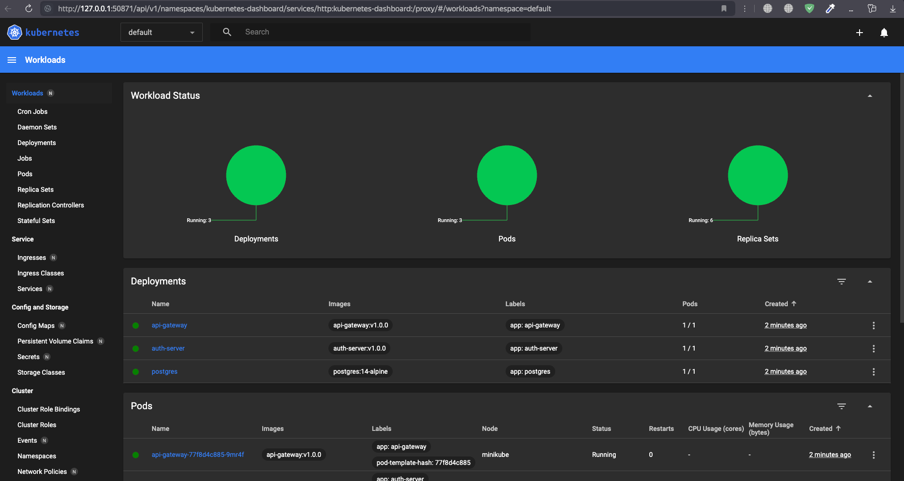

# Find-My-Doc
Поиск копий документов по переданным оригинальным изображениям

1. **Минимум два Deployment**:
- **api-gateway**
- **auth-service**
- **postgres**
2. **Кастомный образ для минимум одного Deployment**:
   - Использованы собственные Dockerfile для сервисов `api-gateway` и `auth-service` в `docker/` директории.

3. Один из Deployment содержит основной контейнер и **init-контейнер**, использует **volume**:
   - В `kubernetes/api-gateway/deployment.yaml` настроен init-контейнер для предварительной подготовки среды.
   - Использован `emptyDir` volume для обмена данными между init-контейнером и основным контейнером.

4. Использование **ConfigMap** и/или **Secret**:
   - `kubernetes/api-gateway/configmap.yaml` содержит конфигурационные данные.
   - `kubernetes/auth-server/secret.yaml` хранит секретные ключи.

5. Наличие **Service** хотя бы для одного сервиса:
   - `kubernetes/api-gateway/service.yaml` определяет сервис для `api-gateway`.
   - `kubernetes/auth-service/service.yaml` определяет сервис для `auth-service`.

6. Реализация **Liveness** и/или **Readiness** проб:
   - В `kubernetes/api-gatewa/deployment.yaml` настроены Liveness и Readiness пробы для мониторинга состояния контейнеров.

7. Применение **лейблов**:
   - Все Deployment используют лейблы `app: <service-name>` для выбора соответствующих ресурсов.

# Структура исходного проекта 
```plaintext
Find-my-doc/ 
├── backend/
│   ├── common/
│   │   ├── src/
│   │   │   ├── main/
│   │   │   │   ├── java/
│   │   │   │   │   └── ru/aidoc/common/
│   │   │   │   │       ├── config/           # Общие конфигурации
│   │   │   │   │       ├── dto/              # Общие DTO
│   │   │   │   │       ├── entity/           # Общие сущности
│   │   │   │   │       ├── exceptions/       # Кастомные исключения
│   │   │   │   │       ├── utils/            # Утилиты
│   │   │   │   │       └── security/         # Безопасность
│   │   │   └── resources/
│   │   │       ├── application.yml          # Базовая конфигурация
│   │   │       └── logback.xml              # Конфигурация логирования
│   │   └── test/
│   │       ├── MockDataGenerator.java       # Генерация тестовых данных
│   │       └── CommonTestUtils.java         # Утилиты для тестов
│   └── pom.xml
│
│   ├── api-gateway/
│   │   ├── src/
│   │   │   ├── main/
│   │   │   │   └── java/
│   │   │   │       └── ru/aidoc/apigateway/
│   │   │   │           ├── config/
│   │   │   │           ├── controller/
│   │   │   │           ├── service/
│   │   │   │           └── model/
│   │   │   └── resources/
│   │   │       └── application.yml
│   │   └── test/
│   └── pom.xml
│
│   ├── auth-service/
│   │   ├── src/
│   │   │   ├── main/
│   │   │   │   └── java/
│   │   │   │       └── ru/aidoc/authservice/
│   │   │   │           ├── config/
│   │   │   │           ├── controller/
│   │   │   │           ├── service/
│   │   │   │           └── model/
│   │   │   └── resources/
│   │   │       └── application.yml
│   │   └── test/
│   └── pom.xml
│
├── frontend/
│   ├── src/
│   │   ├── api/                 # API клиенты
│   │   ├── components/          # React компоненты
│   │   ├── pages/               # Страницы приложения
│   │   ├── services/            # Сервисы
│   │   ├── utils/               # Утилиты
│   │   └── styles/              # CSS стили
│   ├── public/                  # Статические файлы
│   ├── package.json
│   └── webpack.config.js

```
# Структура готового проекта
```plaintext
Find-my-doc/ 
├── backend/
│   ├── common/
│   │   ├── src/
│   │   │   ├── main/
│   │   │   │   ├── java/
│   │   │   │   │   └── ru/aidoc/common/
│   │   │   │   │       ├── config/           # Общие конфигурации
│   │   │   │   │       ├── dto/              # Общие DTO
│   │   │   │   │       ├── entity/           # Общие сущности
│   │   │   │   │       ├── exceptions/       # Кастомные исключения
│   │   │   │   │       ├── utils/            # Утилиты
│   │   │   │   │       └── security/         # Безопасность
│   │   │   └── resources/
│   │   │       ├── application.yml          # Базовая конфигурация
│   │   │       └── logback.xml              # Конфигурация логирования
│   │   └── test/
│   │       ├── MockDataGenerator.java       # Генерация тестовых данных
│   │       └── CommonTestUtils.java         # Утилиты для тестов
│   └── pom.xml
│
│   ├── api-gateway/
│   │   ├── src/
│   │   │   ├── main/
│   │   │   │   └── java/
│   │   │   │       └── ru/aidoc/apigateway/
│   │   │   │           ├── config/
│   │   │   │           ├── controller/
│   │   │   │           ├── service/
│   │   │   │           └── model/
│   │   │   └── resources/
│   │   │       └── application.yml
│   │   └── test/
│   └── pom.xml
│
│   ├── auth-service/
│   │   ├── src/
│   │   │   ├── main/
│   │   │   │   └── java/
│   │   │   │       └── ru/aidoc/authservice/
│   │   │   │           ├── config/
│   │   │   │           ├── controller/
│   │   │   │           ├── service/
│   │   │   │           └── model/
│   │   │   └── resources/
│   │   │       └── application.yml
│   │   └── test/
│   └── pom.xml
│
├── kubernetes/
│   ├── api-gateway/
│   │   ├── configmap.yaml
│   │   ├── deployment.yaml
│   │   ├── service.yaml
│   │   └── secret.yaml
│   ├── auth-server/
│   │   ├── configmap-db-url.yaml
│   │   ├── configmap.yaml
│   │   ├── secret-db-credentials.yaml
│   │   ├── secret.yaml
│   │   ├── deployment.yaml
│   │   └── service.yaml
│   ├── postgres /
│   │   ├── configmap-db-init-scripts.yaml
│   │   ├── postgres-deployment.yaml
│   │   ├── postgres-pvc.yaml
│       └── postgres-service.yaml
│
└── docker/
    ├── api-gateway/
    │   └── Dockerfile
    ├── auth-service/
    │   └── Dockerfile
├── frontend/
│   ├── src/
│   │   ├── api/                 # API клиенты
│   │   ├── components/          # React компоненты
│   │   ├── pages/               # Страницы приложения
│   │   ├── services/            # Сервисы
│   │   ├── utils/               # Утилиты
│   │   └── styles/              # CSS стили
│   ├── public/                  # Статические файлы
│   ├── package.json
│   └── webpack.config.js
├── docker-compose.yml           # В корне проекта

```

# Первый шаг: Создание Docker директории для сборки образов сервисов бэкенда

В этом шаге я создал директорию `docker`, в которой разместил `Dockerfile` для сборки образов различных сервисов бэкенда.

## Сборка образа для API Gateway

**Файл**: `docker/api-gateway/Dockerfile`

## Сборка образа для Auth Service
**Файл**: `docker/auth-service/Dockerfile`

В этих `Dockerfile` создаются два образа:

1. **Для API Gateway**, который включает в себя сборку как фронтенда, так и бэкенда.
2. **Для Auth Service**, который включает только сборку сервиса аутентификации и его зависимостей.


# Второй шаг: После этого я создал файл `docker-compose.yml`, чтобы проверить работу сборки и убедиться, что сервисы могут взаимодействовать друг с другом. В файле определены следующие сервисы:

1. **Postgres** — для хранения данных:
    - Используется образ `postgres:14-alpine`.
    - Переменные окружения для настройки базы данных (`POSTGRES_USER`, `POSTGRES_PASSWORD`, `POSTGRES_DB`).
    - Монтируются volumes для хранения данных и инициализации базы данных.
    - Порты: `5432:5432`.

2. **API Gateway**:
    - Строится из `docker/api-gateway/Dockerfile`.
    - Переменная окружения `SPRING_PROFILES_ACTIVE: docker` для активации профиля для Docker.
    - Порты: `8080:8080`.

3. **Auth Server**:
    - Строится из `docker/auth-server/Dockerfile`.
    - Зависит от сервиса `postgres` (через `depends_on`).
    - Настроены параметры подключения к базе данных через переменные окружения (`SPRING_DATASOURCE_URL`, `SPRING_DATASOURCE_USERNAME`, `SPRING_DATASOURCE_PASSWORD`).
    - Переменная окружения `SPRING_PROFILES_ACTIVE: docker` для активации профиля для Docker.
    - Порты: `8081:8081`.

4. Также создается volume для хранения данных Postgres (`postgres_data`).
## Процесс сборки сервиса 
Для сборки сервиса используйте команду:
```
docker compose up --build
```
> **Примечание:** Сборка может занять продолжительное время, иногда до 30 минут, в зависимости от состояния сети.

## Сборка образа для API Gateway

Для сборки образа для **API Gateway** используется два этапа: сборка фронтенда и бэкенда.

### 1. Сборка фронтенда
На первом этапе используется базовый образ `node:18` для сборки фронтенд-части приложения.

```dockerfile
FROM node:18 AS frontend
WORKDIR /app/frontend
```
Копируем package.json и package-lock.json: Все необходимые зависимости для фронтенда копируются в контейнер.
```dockerfile
COPY frontend/package*.json ./
COPY frontend/ .
```
Сборка фронтенда: Для сборки используется команду npm run build:minikube, которая генерирует оптимизированный бандл для продакшн-окружения.
```dockerfile
RUN npm run build:minikube
```
### 2. Сборка бэкенда
На втором этапе используется образ maven:3.8.5-openjdk-17 для сборки бэкенд-части приложения.

```
FROM maven:3.8.5-openjdk-17 AS build
WORKDIR /app/backend
```
Фронтенд, собранный на первом этапе, копируется в статические ресурсы API Gateway, чтобы они могли быть обслуживаемы сервером.
```dockerfile
COPY --from=frontend /app/frontend/build/ api-gateway/src/main/resources/static/
```
Для сборки используется Maven, и команда mvn clean package компилирует только нужный модуль — api-gateway — и его зависимости.
--
После выполнения всех этих шагов будет создан Docker-образ, который содержит как фронтенд, так и бэкенд части API Gateway, готовые к запуску.

## Сборка образа для Auth Service

Для сборки образа для **Auth Service** используется двухэтапный процесс: сначала сборка с помощью Maven, а затем финальная сборка с использованием минимизированного образа JDK.

### 1. Сборка с использованием Maven
На первом этапе используется образ `maven:3.8.5-openjdk-17`, который обеспечивает все необходимые инструменты для компиляции и сборки проекта с использованием Maven.

```dockerfile
FROM maven:3.8.5-openjdk-17 AS build
WORKDIR /app/backend
```

Шаги копирования такие же как в api-gateway

На втором этапе используется образ openjdk:17-jdk-slim, который является минимизированным образом JDK, предназначенным для запуска Java-программ.
```dockerfile
FROM openjdk:17-jdk-slim
WORKDIR /app/backend
```

После завершения процесса сборки будет создан Docker-образ для Auth Service, который включает все необходимые зависимости и может быть использован для запуска аутентификационного сервиса в контейнере.


# Внешний вид сайта после сборки 

# Вид главной страницы(домашней)

# Приложение в docker


## Папка Kubernetes

Директория `kubernetes` содержит манифесты для развёртывания компонентов системы в Kubernetes. Она разделена на три основные поддиректории:

### 1. **api-gateway**
Манифесты для развёртывания и настройки **API Gateway**:
- `configmap.yaml` — конфигурационные параметры.
- `deployment.yaml` — описание Deployment для API Gateway.
- `secret.yaml` — секреты для хранения чувствительных данных.
- `service.yaml` — описание Service для доступа к API Gateway.

### 2. **auth-server**
Манифесты для **Auth Server**:
- `configmap-db-url.yaml` — ConfigMap с параметрами подключения к базе данных.
- `configmap.yaml` — общие конфигурационные параметры для сервиса.
- `deployment.yaml` — описание Deployment для Auth Server.
- `secret-db-credentials.yaml` — секреты для аутентификации в базе данных.
- `secret.yaml` — дополнительные секреты.
- `service.yaml` — описание Service для доступа к Auth Server.

### 3. **postgres**
Манифесты для базы данных **Postgres**:
- `configmap-db-init-scripts.yaml` — ConfigMap с инициализационными скриптами для базы данных.
- `postgres-deployment.yaml` — описание Deployment для Postgres.
- `postgres-pvc.yaml` — Persistent Volume Claim для хранения данных Postgres.
- `postgres-service.yaml` — описание Service для доступа к базе данных.

### Структура папки:
```plaintext
kubernetes/
├── api-gateway/
│   ├── configmap.yaml
│   ├── deployment.yaml
│   ├── secret.yaml
│   └── service.yaml
├── auth-server/
│   ├── configmap-db-url.yaml
│   ├── configmap.yaml
│   ├── deployment.yaml
│   ├── secret-db-credentials.yaml
│   ├── secret.yaml
│   └── service.yaml
└── postgres/
    ├── configmap-db-init-scripts.yaml
    ├── postgres-deployment.yaml
    ├── postgres-pvc.yaml
    └── postgres-service.yaml
```
# Выполненные требования
1. **Минимум два Deployment**:
- **api-gateway**
- **auth-service**
- **postgres**
2. **Кастомный образ для минимум одного Deployment**:
   - Использованы собственные Dockerfile для сервисов `api-gateway` и `auth-service` в `docker/` директории.

3. Один из Deployment содержит основной контейнер и **init-контейнер**, использует **volume**:
   - В `kubernetes/api-gateway/deployment.yaml` настроен init-контейнер для предварительной подготовки среды.
   - Использован `emptyDir` volume для обмена данными между init-контейнером и основным контейнером.

4. Использование **ConfigMap** и/или **Secret**:
   - `kubernetes/api-gateway/configmap.yaml` содержит конфигурационные данные.
   - `kubernetes/auth-server/secret.yaml` хранит секретные ключи.

5. Наличие **Service** хотя бы для одного сервиса:
   - `kubernetes/api-gateway/service.yaml` определяет сервис для `api-gateway`.
   - `kubernetes/auth-service/service.yaml` определяет сервис для `auth-service`.

6. Реализация **Liveness** и/или **Readiness** проб:
   - В `kubernetes/api-gatewa/deployment.yaml` настроены Liveness и Readiness пробы для мониторинга состояния контейнеров.

7. Применение **лейблов**:
   - Все Deployment используют лейблы `app: <service-name>` для выбора соответствующих ресурсов.

## Makefile для управления сборкой и деплоем сервисов

### Основные переменные
- `IMAGE_AUTH_SERVER` — имя и версия Docker-образа для **Auth Server**.
- `IMAGE_API_GATEWAY` — имя и версия Docker-образа для **API Gateway**.
- `KUBECTL_CONTEXT` — контекст для **kubectl** (например, Minikube).

### Основные цели и задачи

#### 1. **Настройка окружения Docker**
Команда настраивает **Docker CLI** для использования демона Docker в **Minikube**:

```makefile
make docker-env
```
### 2. Сборка Docker-образов
Сборка образов для Auth Server и API Gateway:

Сборка всех образов:
```makefile
make build
```
Сборка Auth Server:
```dockerfile
make build-auth-server
```

Сборка API Gateway:
```dockerfile
make build-api-gateway
```

### 3. Деплой в Kubernetes
   Развертывание сервисов в Kubernetes:

Полный деплой:
```dockerfile
make deploy
```
Деплой Postgres:

```
make deploy-postgres
```
Деплой Auth Server:
```
make deploy-auth-server
```
Деплой API Gateway:
```
make deploy-api-gateway
```

### 4. Очистка ресурсов Kubernetes
Удаление всех созданных ресурсов из Kubernetes:
```
make clean
```

### 5. Проверка статуса подов
Получение текущего статуса всех подов:
```dockerfile
make status
```
### Полный цикл сборки и деплоя
Команда выполняет все шаги: настройка окружения, сборка Docker-образов, деплой и перезапуск деплойментов:
```dockerfile
make all
```

# Инструкция для запуска проекта с использованием Minikube и Makefile

Следуйте данной инструкции, чтобы развернуть проект в Kubernetes с помощью Minikube и Makefile.

---

## Шаги для запуска

### 1. **Запуск Minikube**
Запустите Minikube, чтобы поднять локальное Kubernetes-окружение:
```bash
minikube start
```

## 2. Настройка Docker CLI для использования Minikube
Настройте Docker CLI, чтобы сборка образов происходила в окружении Minikube:

## 3. Сборка Docker-образов
Выполните сборку образов для сервисов с помощью команды `make build`:

## 4. Полный цикл сборки и деплоя
Запустите команду `make all`, которая выполнит:
- Настройку Docker CLI.
- Сборку всех образов.
- Деплой сервисов в Kubernetes.
- Перезапуск всех деплойментов.

## 5. Проброс порта для API Gateway
После успешного деплоя сервисов выполните проброс порта, чтобы получить доступ к API Gateway:
```dockerfile
kubectl port-forward svc/api-gateway-service 8080:8080
```
Теперь API Gateway будет доступен по адресу: http://localhost:8080.
## 6. Открытие Minikube Dashboard
```dockerfile
minikube dashboard
```
Minikube предоставляет удобный интерфейс для мониторинга ресурсов в Kubernetes:

## Завершение работы
### 1. Остановка Minikube
Для остановки запущенного окружения выполните:
```dockerfile
minikube stop
```
### 2. Удаление окружения Minikube
Чтобы полностью удалить окружение Minikube, включая все ресурсы и данные, выполните:
```dockerfile
minikube delete
```

# Выводы
Приложение Find-my-doc успешно развернуто в Minikube, удовлетворяя всем заданным требованиям. Использованы кастомные Docker-образы, настроены init-контейнеры, volumes, ConfigMap и Secrets. Реализованы Liveness и Readiness пробы, а также применены необходимые лейблы для управления ресурсами.

